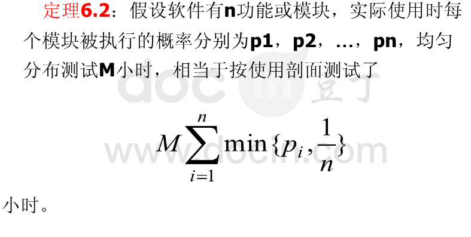

内容：假设某软件有7个模块，实际使用时每个模块被执行的概率分别为p1，p2，…，p7，

其数据如下:

模块概率    p1    p2    p3    p4    p5    p6    p7

概率取值   0.12  0.2   0.17  0.02  0.3   0.1   0.09

请问均匀分布测试M=100小时，相当于按使用剖面测试了多少小时?

1/7 = 0.14285714285714285

answer = (0.12+1/7+1/7+0.02+1/7+0.1+0.09)*100

正确答案不知道是多少/不清楚老师在哪里四舍五入的（结果不对）
