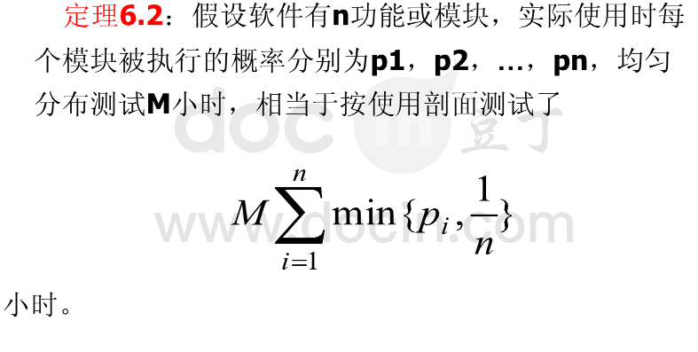

此题的步骤和要求:
1) 按题目要求做计算。;
2) 提交计算结果，注意题号要一致。
3) 计算结果如果有小数的话，保留两位小数，第三位小数四舍五入，如果有特殊说明例外。
   如果不足两位小数请补0，例如如果计算是4.1，则提交的是4.10。

内容：某系统有6个模块，在均匀分布假设下，每个模块被执行的概率为1/6。假设系统总共的测试时间为120H，则每个模块的测试时间为20H。根据对用户使用剖面的分析，6个模块被执行的概率分别近似为：0.14, 0.23, 0.26, 0.20, 0.07, 0.1。对同样的120H，6个模块实际的执行时间分别为16.8, 27.6, 31.2, 24.0, 8.4, 12.0。请计算相当于按使用剖面的测试时间是多少小时？

1/6 = 0.1666666666

answer = (0.14+1/6+1/6+1/6+0.07+0.1)*120=97.20
